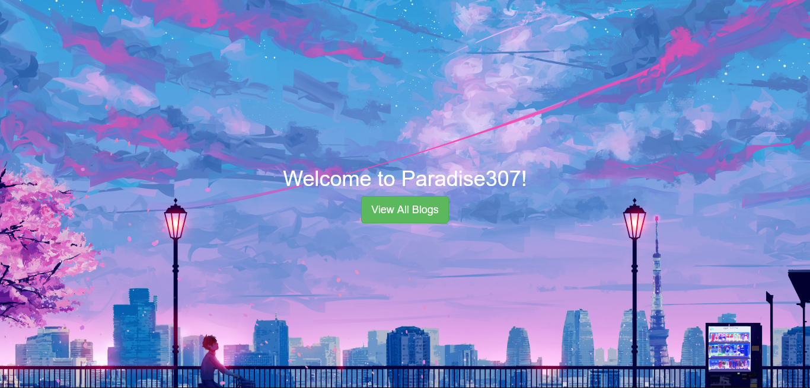
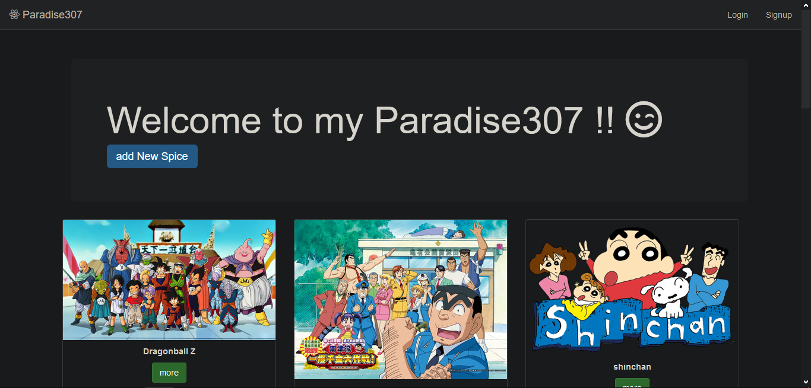
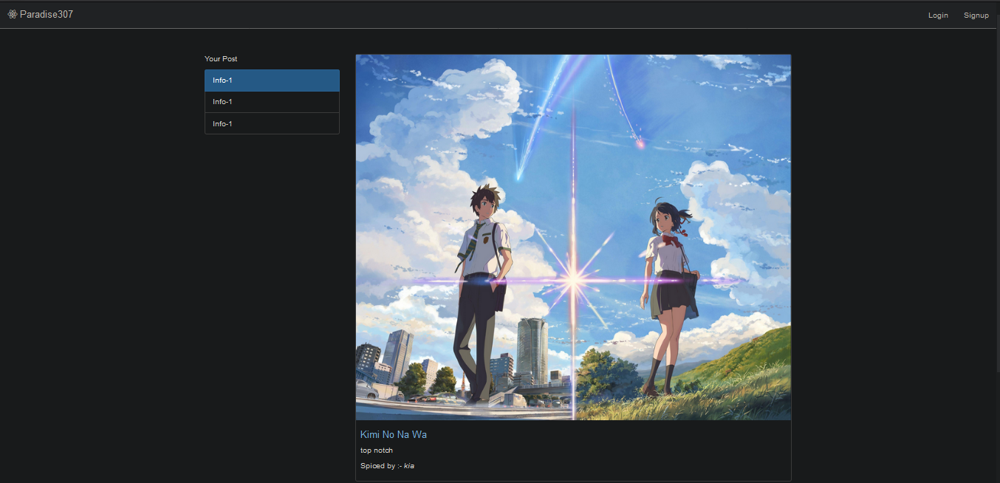
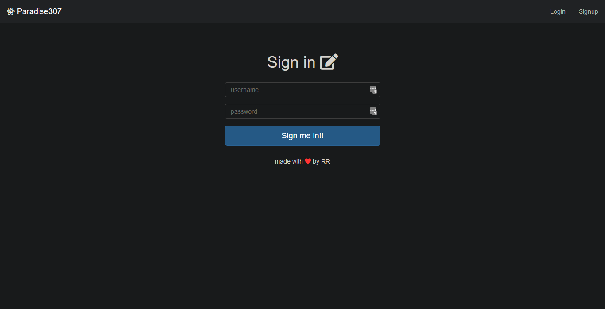
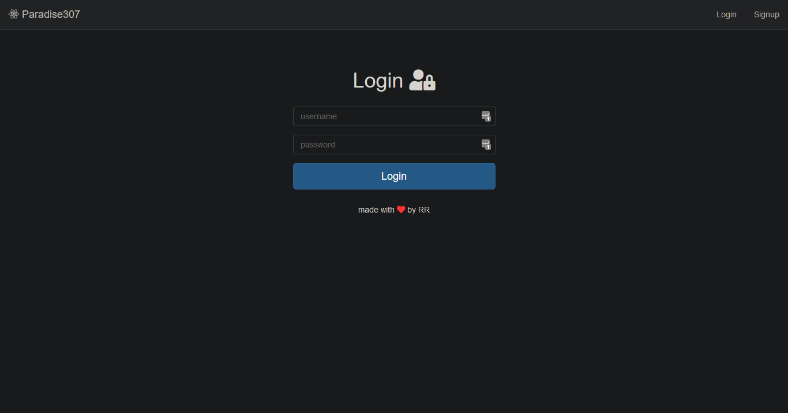
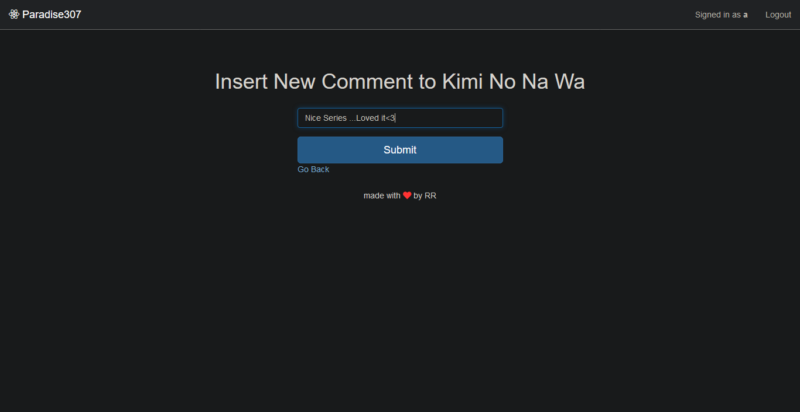

# Paradise(Blogging Web Application)
- A blogging web Application that allowes user to post thier blogs.
- Application allows user to create their account.
- User can add comment to others post.
- Only registered users are allowed to post the content on the application.
- Registered users can edit/delete their post.

# Screenshots
- Welcome Screen(Using Image trasition animation changes image after short interval of time)

- Index Page

- Post Page(zoomed out)

- SignUp

- Login

- Posting Comment

# Instruction
- Step1: Install node
- Step2: npm install express mongoose body-parser ejs passport passport-local
- Step3: node app.js
- Step4: open your browser and write "localhost:3000" on search bar.
